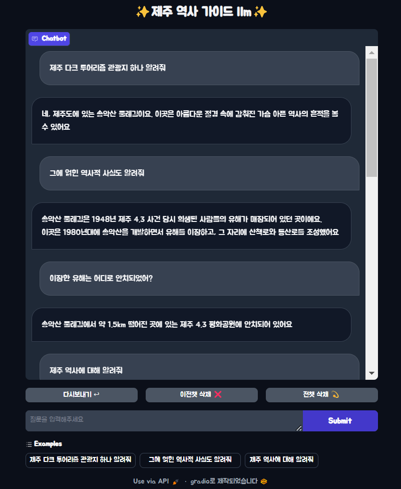
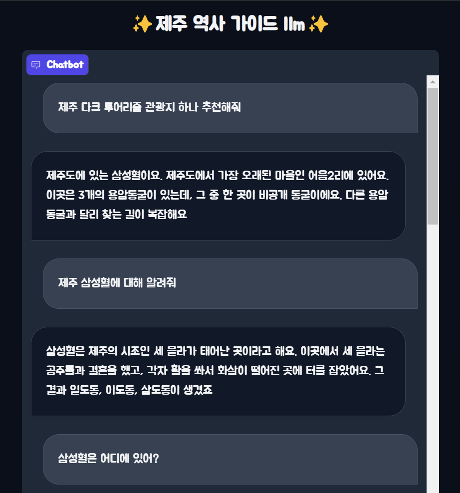

# RAG 프로그램 구현과정
순서 : 기초 설명 - 구현 내용&코드 - 결과 - 고찰
### 1. RAG Basic
RAG는 검색 증강 생성의 약자로 대규모 언어 모델의 출력을 최적화하여 응답을 생성하기 전 학습 데이터 소스 외부의 신뢰 할 수 있는 지식 베이스를 참조하도록 하는 프로세스이다.


RAG의 구현을 위해서는 Indexing 과정과 Retrieval and Generation의 두 과정을 거친다.

### 2. Indexing
Indexing은 외부데이터 생성으로 원래 LLM 외부에 있는 새 데이터를 외부 데이터라고 한다. 이를 생성형 ai모델이 이해 할 수 있도록 지식 라이브러리를 생성하는 과정이 Indexing이다. 

- API나 데이터베이스, 문서와 같은 여러 데이터 소스에서 추출 가능 
- 데이터를 수치로 변환하고 벡터 데이터 베이스에 저장 / 벡터 데이터 베이스 = 생성형 ai모델이 이해 할 수 있는 지식 라이브러리

즉, 소스로 부터 데이터를 모아 vectorstore를 구축하는 파이프라인이다.

 

각 과정에서는 다음과 같은 일을 진행한다.
#### Load : pdf, Html, txt 여러 형태의 소스들을 loader을 통해 불러오고 처리
#### Split : splitter을 이용해 위에서 불러온 문서를 처리 가능한 작은 단위로 분할
#### Embed :각 문서 또는 문서의 일부를 벡터 형태로 변환하여, 문서의 의미를 수치화 
+ 이는 책의 내용을 요약하여 핵심 키워드로 표현하는 것과 비슷하다.
#### store : 임베딩된 벡터들을 데이터베이스에 저장
-  요약된 키워드를 색인화하여 나중에 빠르게 찾을 수 있도록 하는 과정이다.

### 3. Retrieval and Generation


#### Retrieval: 기존 정보 검색 시스템을 사용하여 target information에 대한 문서 또는 정보를 검색
#### Generator: Retriever가 검색한 정보를 바탕으로 의미있는 문장 또는 문단 생성

이를 통해 RAG는 LLM의 기본 모델 자체를 수정하지 않고도 최신 데이터를 기반으로 답변할 수 있게 된다.

# 구현 - 제주 역사 관광지 가이드 llm
## Indexing
### 1. DATA
주제에 맞는 소스를 찾고 편의를 위해 pdf로 저장했다.
데이터 목록
```
'가슴 아픈 제주 역사를 돌아보는 다크투어 여행지 _ 지식백과.pdf'
'역사 문화의 숨결을 찾아서, 제주 원도심 여행 _ 지식백과.pdf'
'제주 빌레못 동굴 _ 지식백과.pdf'
'제주도 표류의 역사 _ 지식백과.pdf'
'제주도의 역사가 시작된 삼성혈 _ 지식백과.pdf'
'제주의 아픈 역사 돌아보는 다크투어리즘, 8.15를 통해 보는 제주 항일 역사의 발자취 _ 지식백과.pdf'
'제주인 항일운동 역사의 보고(寶庫) _제주항일기념관_ _ 지식백과.pdf'
'제주전쟁역사평화박물관 _ 지식백과.pdf'
```
### 2. vectorstore 구축 
chromadb와 langchain을 통해 앞에 나온 파이프라인을 통해 vectorstore 구축했다.
```
from langchain.text_splitter import RecursiveCharacterTextSplitter
from langchain_community.document_loaders import PyPDFDirectoryLoader
from langchain_chroma import Chroma
from langchain_community.embeddings import OllamaEmbeddings

DATA_PATH = "/home/eunjikim22/rag_project/data"
DB_PATH = "/home/eunjikim22/rag_project/vectorstores/db/"


def create_vector_db():
    # 부르고 pdf 갯수 반환
    loader = PyPDFDirectoryLoader(DATA_PATH)
    documents = loader.load()
    print(f"Processed {len(documents)} pdf files")

    # 텍스트 분할 문서 단위로 자름
    text_splitter = RecursiveCharacterTextSplitter(chunk_size=1000, chunk_overlap=50)
    texts = text_splitter.split_documents(documents)
    print("split complete")

    # 인덱싱 분할된 문서를 검색가능한 형태로 만듬
    vectorstore = Chroma.from_documents(documents= texts, 
                                        embedding=OllamaEmbeddings(model="llama3ko"), persist_directory=DB_PATH)      

if __name__ == "__main__":
    create_vector_db()
```

*PyPDFDirectoryLoader*와 *load*함수를 통해 pdf파일을 불러오고 이를 *RecursiveCharacterTextSplitter*을 사용하여 텍스트를 분할하고 *text_splitter.split_documents*을 사용하여 문서단위로 자른다.
이를 *Chroma.from_documents*함수를 통해 분할된 문서를 검색 가능한 형태로 구축한다. 
- embedding으로 OllamaEmbeddings을 사용했으며 모델은 챗봇 구현에 사용할 huggingface모델인 Llama-3-Open-Ko-8B(=llama3ko)를 사용하였다. 

## rag 구축 
langchain의 데모를 기반으로 간단하게 구축을 진행했다.
[참고페이지](https://python.langchain.com/v0.2/docs/tutorials/qa_chat_history/)에서 prompt를 영어에서 한국어로 바꾸어 진행하였고 추후 챗봇 구축을 위해 수정하여 진행하였다.

```
from langchain_community.chat_models import ChatOllama
from langchain_chroma import Chroma
from langchain_community.embeddings import OllamaEmbeddings
from langchain.chains import create_retrieval_chain
from langchain_core.prompts import ChatPromptTemplate
from langchain.chains.combine_documents import create_stuff_documents_chain

from langchain.chains import create_history_aware_retriever
from langchain_core.prompts import MessagesPlaceholder
from langchain_core.messages import AIMessage, HumanMessage
import time

ollama = ChatOllama(model="llama3ko")

DB_PATH = "/home/eunjikim22/rag_project/vectorstores/db"
vectorstore = Chroma(persist_directory=DB_PATH,
                     embedding_function=OllamaEmbeddings(model='llama3ko'))
retriever = vectorstore.as_retriever()

system_prompt = (
    "당신은 Q&A 작업의 보조자입니다."
    "검색된 컨텍스트의 다음 부분을 사용하여 질문에 대답하십시오. "
    "질문. 답을 모르면 이렇게 말하세요 "
    "모르겠습니다. 최대 3개의 문장을 사용하세요."
    "간결하게 대답하세요."
    "\n\n"
    "{context}"
)

contextualize_q_system_prompt = (
    "채팅 기록 및 최근 사용자 질문 제공"
    "채팅 기록의 맥락을 참조할 수 있습니다."
    "이해할 수 있는 독립형 질문을 공식화하세요."
    "채팅 기록이 없습니다. 질문에 대답하지 마세요."
    "필요하다면 다시 구성하고 그렇지 않으면 그대로 반환하세요."
)

contextualize_q_prompt = ChatPromptTemplate.from_messages(
    [
        ("system", contextualize_q_system_prompt),
        MessagesPlaceholder("chat_history"),
        ("human", "{input}"),
    ]
)

history_aware_retriever = create_history_aware_retriever(
    ollama, retriever, contextualize_q_prompt
)

qa_prompt = ChatPromptTemplate.from_messages(
    [
        ("system", system_prompt),
        MessagesPlaceholder("chat_history"),
        ("human", "{input}"),
    ]
)

question_answer_chain = create_stuff_documents_chain(ollama, qa_prompt)
rag_chain = create_retrieval_chain(history_aware_retriever, question_answer_chain)

chat_history = []
start = time.time()
question = "제주 다크 투어리즘 관광지 한가지 추천해줘"
ai_msg_1 = rag_chain.invoke({"input": question, "chat_history": chat_history})
chat_history.extend(
    [
        HumanMessage(content=question),
        AIMessage(content=ai_msg_1["answer"]),
    ]
)
print(ai_msg_1["answer"])

second_question = "그에 얽힌 역사적 사실도 알려줘"
ai_msg_2 = rag_chain.invoke({"input": second_question, "chat_history": chat_history})

print(ai_msg_2["answer"])

end = time.time()
print(f'{end-start:.5f}sec')
```
invoke한 결과는 다음과 같다.
```
question = "제주 다크 투어리즘 관광지 한가지 추천해줘"

네, 제주도에 있는 삼성혈이요. 이곳은 삼을 심었다는 뜻으로, 신화 속의 세 을라가 태어나고 성장한 곳입니다. 그 주변에는 작은 비석들이 서 있고, 그 옆에는 삼성전이 있습니다
```
```
second_question = "그에 얽힌 역사적 사실도 알려줘"

네, 이곳은 제주도의 건국 신화가 시작된 곳입니다. 고조선의 단군 신화, 고구려의 주몽 신화, 신라의 박혁거세 신화 등 대부분의 신화들은 나라를 세운 시조가 하늘에서 내려오거나 알에서 태어난 것이 많아요. 그런데 제주도의 신화는 땅에서 솟아나지요. 또 시조가 한 명이 아니라 세 명인 점도 특이해요.
그리고 벽랑국의 공주들이 곡식과 가축을 가져왔다는 이야기는 바다를 통해서 외래 문화가 들어왔다는 것을 의미합니다
```

## rag chatbot 구현 
위의 내용을 기반으로 구현하여 앞 부분은 같아서 생략하겠다. 밑의 코드를 통해 위에서 구현한 rag를 gradio를 통해 사용해 볼 수 있다.
```
import gradio as gr

# app start
def response(message, history):
     chat_history = []
     for human,ai in history:
         chat_history.extend(
              [HumanMessage(content=human),
               AIMessage(content=ai)])
     ollama_response=rag_chain.invoke({"input": message, "chat_history": chat_history})
     return ollama_response["answer"]

theme = gr.themes.Soft(font=[gr.themes.GoogleFont("Jua"),"sans-serif"])

# primary_hue=gr.themes.colors.teal, 테마에서 시선을 끄는 색상
# secondary_hue=gr.themes.colors.cyan) 보조요소
# nautral_hue 텍스트 및 기타 중립 요소

gr.ChatInterface(
        fn=response,
        textbox=gr.Textbox(placeholder="질문을 입력해주세요", container=False, scale=7),
        # 채팅창의 크기를 조절한다.
        chatbot=gr.Chatbot(height=600),
        title="✨제주 역사 가이드 llm✨",
        # description="제주 역사 가이드 챗봇입니다.",
        theme=theme,
        examples=[["제주 다크 투어리즘 관광지 하나 알려줘"],["그에 얽힌 역사적 사실도 알려줘"], ["제주 역사에 대해 알려줘"]],
        retry_btn="다시보내기 ↩",
        undo_btn="이전챗 삭제 ❌",
        clear_btn="전챗 삭제 💫"
).launch()

```
## 실행 결과 


## 고찰 
프로젝트를 통해 rag를 간단히 구현해보면서 rag에 대해 배웠다. 실제로 gradio를 통해 챗봇으로 사용했을 때 아쉬운 점이 몇가지 있었다. 한 가지는 문서 임베딩이다. chromadb에 대해 미숙해서 몇번 새롭게 구축을 진행했는데 진행할 때 마다 약간씩 달라지는 것을 느꼈다.
다른 한 가지는 시스템 프롬프트를 아직 적합한 것을 찾지 못한 점이다. 임의로 수정을 하고 진행했을 때 이상한 결과를 얻어 처음으로 돌아가게 되었다. 마지막은 실제로 챗봇을 사용할 때 한정적인 질문에 올바르게 작동한다는 점이다. 위에 결과에서 "제주 다크 투어리즘 하나 말해줘"라고 작성했을 때는 잘 작동하는데 "제주 다트 투어리즘 하나 추천해줘"라고 하면 이상하게 답변하는 경우가 종종있었다. 이 프로젝트를 심화시킨다면 위의 세 가지에 대해서 발전시키고 싶다.

- 밑의 사진은 임베딩이 잘못되서 일어난 헤프닝으로 생각해서 새롭게 벡터스토어 구축 후에는 좋아졌다. + 삼성혈은 이도이동에 있다.


## reference
#### Markdown
https://aws.amazon.com/ko/what-is/retrieval-augmented-generation/

https://velog.io/@jjlee6496/RAG%EB%9E%80

https://wikidocs.net/233780
#### chatbot
https://velog.io/@t_wave/gradiolangchainchatbot 

https://python.langchain.com/v0.2/docs/tutorials/qa_chat_history/
#### chromadb
https://api.python.langchain.com/en/latest/vectorstores/langchain_chroma.vectorstores.Chroma.html

https://how.wtf/how-to-use-chroma-db-step-by-step-guide.html
#### css-font
https://fonts.google.com/selection/embed 

https://www.gradio.app/guides/theming-guide 